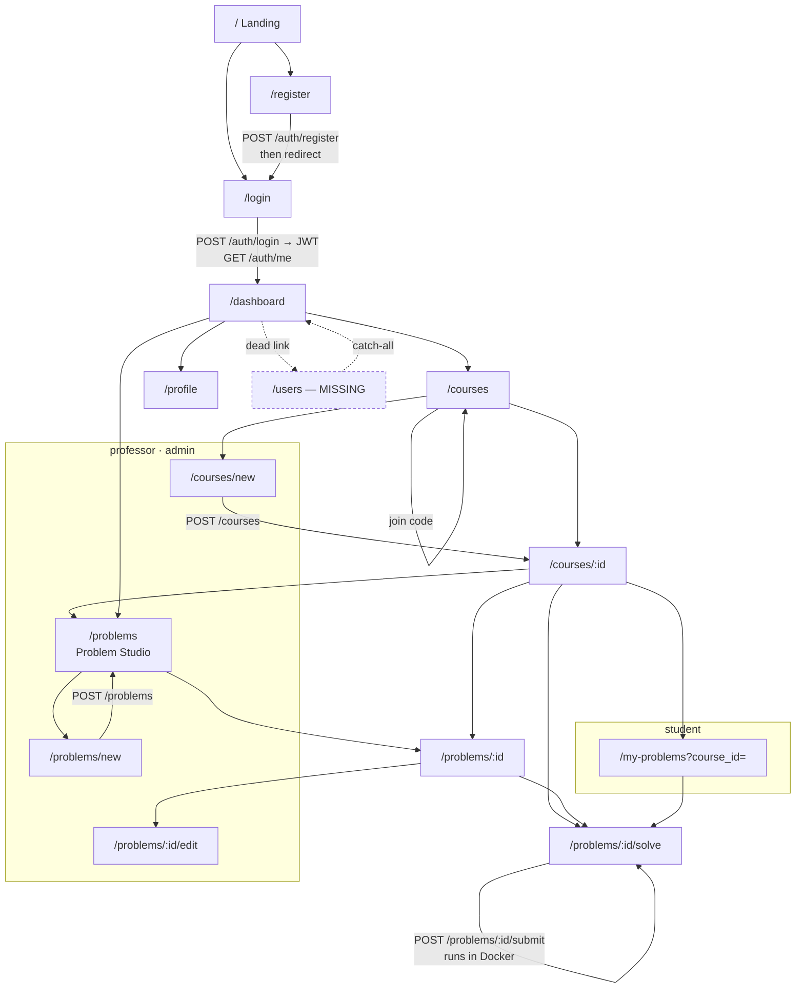
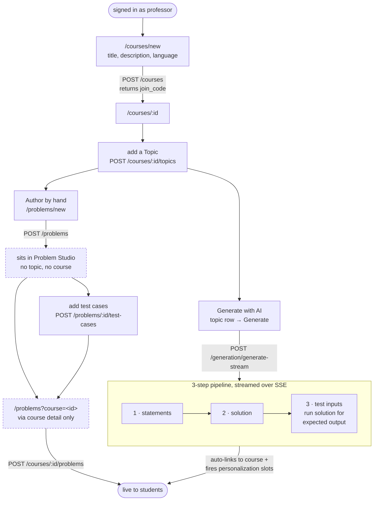
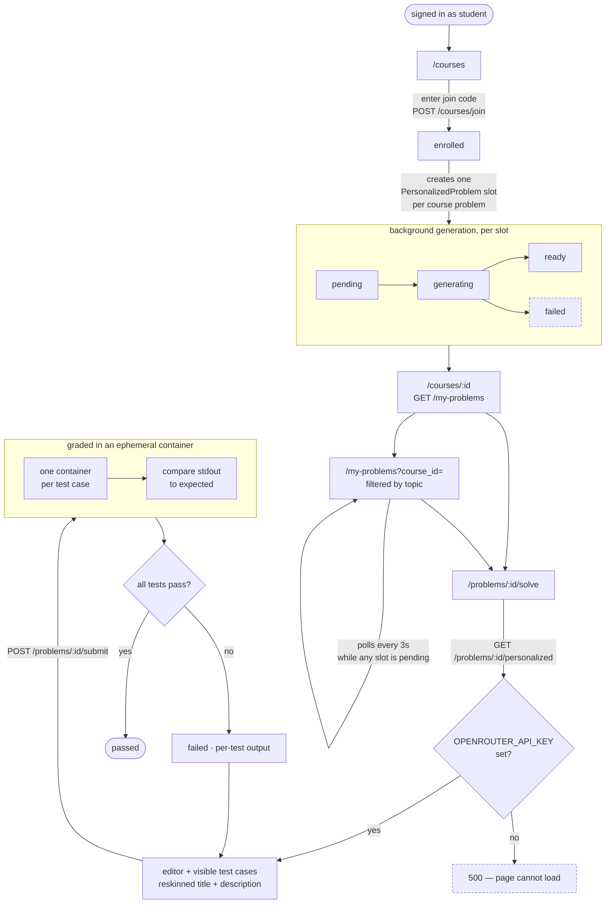

# User Flow

Every screen in codereps.ai, how you reach it, and what the app calls behind each step — written so
you can replay a scenario from a cold start and know what you should see.

Diagrams are Mermaid; they render on GitHub and in most editors.

- **App** http://localhost:5173 · **API** http://127.0.0.1:8000 (docs at `/docs`)
- Use `127.0.0.1`, not `localhost`, for the API. See [README](README.md#troubleshooting).

| Role | Email | Password |
|---|---|---|
| Professor | `professor@codereps.ai` | `prof123` |
| Student | `student@codereps.ai` | `student123` |
| Admin | `admin@codereps.ai` | `admin123` |

In dev the login page has a **Dev · sign in as** row with one button per role, so switching roles
mid-scenario is a single click.

---

## Contents

- [Route map](#route-map)
- [The whole app at a glance](#the-whole-app-at-a-glance)
- [Professor: getting problems in front of students](#professor-getting-problems-in-front-of-students)
- [Student: practice loop](#student-practice-loop)
- [Replay scenarios](#replay-scenarios)
- [Dead ends and traps](#dead-ends-and-traps)
- [Resetting between runs](#resetting-between-runs)

---

## Route map

Declared in `frontend/src/App.tsx`. "Reached from" is the only in-app path — anything marked
*URL only* has no link pointing at it.

| Route | Who | Reached from | Loads |
|---|---|---|---|
| `/` | public | — | Landing page |
| `/login` | public | Landing, Header logout, any 401 | — |
| `/register` | public | Landing, Login | — |
| `/dashboard` | all | after login, sidebar, `*` fallback | `GET /courses` |
| `/courses` | all | sidebar | `GET /courses` |
| `/courses/new` | professor, admin | Dashboard card, Courses button | — |
| `/courses/:id` | all (members) | Courses list, after create | `GET /courses/:id`, `/students`, `/problems` or `/my-problems`, `/topics` |
| `/problems` | professor, admin | sidebar "Problem Studio", Dashboard card | `GET /problems`, `/problems/tags` |
| `/problems?course=<id>` | professor, admin | Course detail "Add problems" | same + enables **Add to course** |
| `/problems/new` | professor, admin | Problem Studio button | — |
| `/problems/:id` | all | Problem Studio, course detail, my-problems | `GET /problems/:id` |
| `/problems/:id/edit` | professor, admin | Problem view | `GET /problems/:id` |
| `/problems/:id/solve` | all | Problem view, course detail, my-problems | `GET /problems/:id/personalized` (student) or `/problems/:id`, `GET /problems/:id/submissions` |
| `/my-problems?course_id=<id>` | student | Course detail → topic row | `GET /courses/:id/my-problems`, `/topics` |
| `/profile` | all | sidebar user badge | `GET /auth/me` |
| `/users` | admin | sidebar, Dashboard card | **route does not exist** → falls to `*` → `/dashboard` |
| `*` | — | — | redirect to `/dashboard` |

---

## The whole app at a glance



The only cycle that matters is the last one: **solve → submit → results → solve again**. That is the
product's core loop.

---

## Professor: getting problems in front of students

Two paths get a problem into a course. Only one of them is wired end to end.



Things that will surprise you when replaying:

- **AI generation publishes immediately.** `_save_problem` writes the problem, links it to the
  course, and creates a personalization slot per enrolled student in one transaction. There is no
  review or approve step (REVIEW.md F4).
- **A hand-authored problem gets no topic.** The manual editor has no topic field, so a manual
  problem never appears under a topic — only in the flat Problem Studio list.
- **A problem with no test cases grades as `passed` with 0/0.** Add test cases before asking a
  student to solve it.
- Generation needs `OPENROUTER_API_KEY` in `backend/.env`. The manual path works without one, but
  a **student still cannot open the result in the UI** without a key — personalization runs on read.
  So a key is effectively required for any end-to-end student scenario.

---

## Student: practice loop



What the student actually sees:

- The **description is personalized** — rewritten around their stated interests — but the algorithm,
  I/O format, and test cases are identical to the original. Same code solves both.
- **Hidden test cases are stripped** from this endpoint, and `solution_code` comes back `null`.
- **The editor opens empty** even when the problem has starter code (REVIEW.md F7), and the buffer
  lives only in React state — a refresh loses it.
- Interests come from `/profile`. Set them *before* enrolling, or the reskin has nothing to work with.
- **Without `OPENROUTER_API_KEY`, the solve page 500s.** The student route calls
  `/problems/:id/personalized`, which generates inline on a `pending`/`failed` slot and lets the
  OpenRouter `401` escape as an unhandled `500`. There is no in-UI fallback to the original problem,
  so this blocks the student loop entirely. See [Dead ends](#dead-ends-and-traps).

---

## Replay scenarios

Each one starts from a clean database unless it says otherwise. See
[Resetting between runs](#resetting-between-runs).

### S1 · Professor stands up a course with a working problem *(no API key needed)*

1. Login → **Dev · sign in as → Professor**.
2. **Courses → Create Course**. Title `CS101`, language `python`. → lands on `/courses/:id`.
3. Note the **join code** on the course page. You need it in S2.
4. **Problem Studio → New Problem**: title `Sum Two`, language `python`, description
   `Read two integers, print their sum.` Save.
5. Open the problem → add two test cases: input `3\n4\n` → `7`, and input `10\n5\n` → `15`
   (mark the second **hidden**).
6. Back to `/courses/:id` → **Add problems** → **Add to course** on `Sum Two`.

**Expect:** the course problem list shows `Sum Two`. `POST /courses/:id/problems` returned 201.

### S2 · Student enrols and solves

Requires S1. **Requires `OPENROUTER_API_KEY`** — without it, step 5 fails with a 500 (see
[Dead ends](#dead-ends-and-traps)). To exercise grading without a key, drive the API directly as in
[S3](#s3--the-three-grading-outcomes).

1. Login → **Dev · sign in as → Student**.
2. *(Optional, do it first)* **Profile** → set interests, so the reskin has material.
3. **Courses** → paste the join code → Join.
4. Open the course. The problem appears with a **Generating…** chip if an API key is set, otherwise
   with the original title.
5. Open it → **Solve**. Type:
   ```python
   a = int(input())
   b = int(input())
   print(a + b)
   ```
6. Submit.

**Expect:** `passed`, 2/2, roughly 100–150 ms per test. Only the non-hidden test case is listed under
Examples, but **both** are graded.

### S3 · The three grading outcomes

From S2's solve screen — or, with no API key, by POSTing to `/api/problems/<id>/submit` with a
student token — submit each of these:

| Code | Expect |
|---|---|
| `print(999)` | `failed` 0/2, per-test actual vs expected |
| `while True: pass` | `failed`, `Time limit exceeded (5s)` |
| `import socket` then `socket.create_connection(("1.1.1.1", 80))` | `failed`, traceback — egress is blocked |

This is the fastest way to confirm the Docker sandbox is genuinely working.

### S4 · AI generation *(needs `OPENROUTER_API_KEY`)*

1. As professor, open a course → add a topic, e.g. `Loops`.
2. On the topic row → **Generate**. Ask for 2 problems, `easy`, `stdin_stdout`, 3 test cases.
3. Watch the SSE log: statements → solution → test inputs → saving.

**Expect:** a `problem_saved` event per problem, each already attached to the course. If a solution
fails all its tests, the pipeline asks the model to fix it and retries twice before erroring out.

### S5 · Login failure modes

1. Sign out (Header).
2. Wrong password → **"Email or password is incorrect."**
3. Stop the backend (`pkill -f "uvicorn app.main:app"`) and reload `/login` → an amber
   **Backend unreachable** panel naming the URL and the command to start it, before you type
   anything. Attempting a sign-in gives the same guidance rather than a bare failure.
4. Restart the backend, reload, sign in.

### S6 · Admin *(currently blocked)*

Sign in as admin → **Users** in the sidebar → you land back on `/dashboard`. The route does not
exist; the API behind it does (REVIEW.md F8). Drive it directly if you need to:

```bash
TOK=$(curl -s -X POST http://127.0.0.1:8000/api/auth/login \
  -d "username=admin@codereps.ai&password=admin123" | python3 -c 'import json,sys;print(json.load(sys.stdin)["access_token"])')
curl -s http://127.0.0.1:8000/api/users -H "Authorization: Bearer $TOK" | python3 -m json.tool
```

---

## Dead ends and traps

Things that make a replay look broken when it is behaving as written. None of these are fixed.

| What you do | What happens | Why |
|---|---|---|
| Sidebar / Dashboard → **Users** as admin | bounces to `/dashboard` | no `/users` route (F8) |
| Course detail → topic row → **Problems** | topic filter applies, but no **Add to course** button | the button reads `?course=`; the topic link sends `?course_id=` |
| Open `/my-problems` with no `course_id` | empty page, no error | the page returns early without a course id |
| Open `/problems/:id` for a problem in no shared course | 403 | per-problem authorization is enforced |
| `GET /api/problems` as a student | returns **every** problem with solutions | list endpoint skips authorization (F1) |
| Student opens any problem with no `OPENROUTER_API_KEY` | **500**, blank solve page | personalization generates on read and the OpenRouter 401 escapes unhandled |
| Solve screen on a problem with starter code | editor is empty | starter code is discarded (F7) |
| Refresh mid-problem | code is gone | buffer is React state only |
| Submit in the wrong language | 400 before anything runs | submission language must equal the problem's |
| Delete a topic | its problems stay in the course, now unreachable by topic | `topic_id` set to `NULL` |
| Leave the app idle | still signed in for 8 h | dev token lifetime; no refresh path (F9) |
| Submit with Docker stopped | every test errors | grading needs the `codereps-runner` image |

---

## Resetting between runs

Scenarios accumulate state — courses, enrolments, personalization slots, submissions. To start over:

```bash
cd backend
rm -f codereps.db
uv run alembic upgrade head
uv run python seed.py
pkill -f "uvicorn app.main:app"
uv run uvicorn app.main:app --reload      # reopen the SQLite file
```

Then clear the stale token in the browser — DevTools → Application → Local Storage →
remove `access_token` — or just sign in again, since the old user id no longer exists and the next
call 401s you back to `/login`.

`seed.py` is idempotent: it no-ops if `admin@codereps.ai` already exists, so it will not duplicate
the demo accounts.

To confirm the runner image is present before a grading scenario:

```bash
docker image inspect codereps-runner >/dev/null && echo "runner OK"
```
